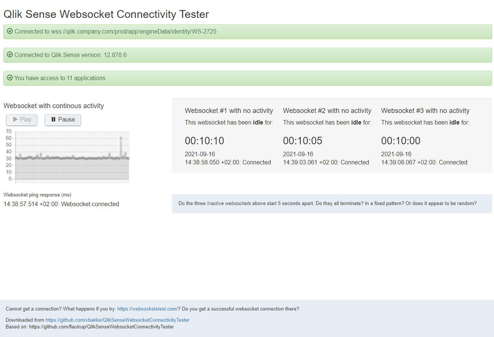

# Qlik Sense Websocket Connectivity Tester
This html file can be used to assess websocket connectivity to your Qlik Sense installation.

## Note:
This fork is quite different from the original flautrup/QlikSenseWebsocketConnectivityTester.

The purpose is to identify problems with websockets. Not just prove that it works. 

Typical problems are network boxes or reverse proxies terminating idle websockets,
or a flaky network that causes the websockets to drop.

If you get 'Connection lost' errors, this tool might help.

Changing the session timeout for the virtual proxy in QMC, won't help. That only helps if you get the message: 'Your session has timed out'! 

'Connection lost' is a different scenario completely.  And it is  not always easy to find the root cause.


# About the Websocket Tester
This web page creates several websockets.

* **Active websocket** - One *Active websocket* that pings the Qlik server every second second.  (You may pause this.) 

* **Inactive websockets** - Three *Inactive websockets*, that only fires an inital ping, then remains dormant. \
The inactive websockets are started 5 seconds apart, which can help to deduct possible causes.



# Network debugging
This tool give you some information that might help you in your debugging:
 * All websockets die at the same time, including the *Active webscoket*
 * The *Inactive websockets* die after a random amount of time, of always the same fixed period
 * The *Inactive websockets* die one by one, 5 seconds apart. The *Active* keeps running
 * It's all random. Any websocket can suddenly die, including the active one, no pattern (I feel sorry for you. Wish you good luck)


## Qlik Session Timeout 
If the Qlik session times out, you don't need this tool. Just change the virtual proxy settings.  Leaving the *Active websocket* running should stop Qlik from timing out the session. Pause the *Active websocket* if you want to test the Qlik Session Timeout.


## Idle websocket timeout 
If the *inactive websockets* all time out after the same fixed time, one by one, then a network box or reverse proxy is killing idle websockets. 

Look at the configuration properties in your network boxes. Any timeout values that match the time above, you might have found a candidate. 

### Azure Gateway
Azure Gateway kills idle websockets after 4 minutes by default.


## Flaky network
If the *Inactive websockets* time out after a random time periode, I have bad news.  Someting is terminating the websocket, and it is not a simple configuration issue.  If they all drop at the same time, something caused a network drop.

As long as the *Active websocket* always keeps running, your problem might be related to idle websockets.

If both *Active* and *Inactive* websockets close at the same time, then some how the whole network was disrupted.


## Long idle time - Deprecated
Long idle time websocket is now removed from the web page, but parts remain in the code.

The Long idle time websocket was needed when the tester still used enigma.js. Enigma.js hid terminations, and you had to ping to check if the webcosket was dead or still alive. Doubling the sleep time between each retry, using binary search when it had reached a timed out websocket.

Hopefully not needed anymore.


# Installation:
Just like the original:  https://community.qlik.com/t5/Knowledge-Base/Qlik-Sense-Websocket-Connectivity-Tester/ta-p/1716909


* Download from https://github.com/vbakke/QlikSenseWebsocketConnectivityTester
* Unzip
* In the QMC create a Content library
* Set the security rule correctly for the intended audience
  * (Set rule appropriately, possibly `(!user.isAnonymous())` for all users, or potentiall `true` to also include anonymous users.)
* Upload `./QlikSenseWebsocketTest.html` file to the content library
* Under `Contents` in your library, see the `URL path` column for the your path to the testing file
  * E.g. https://qlik.company.com/prefix/content/WebSocketTester/QlikSenseWebsocketTest.html


# Websockets
A standard web request, is like sending someone a text message, and waiting for the reply.*\
(* Not on TCP level, I know. Just keep on reading....)

A websocket is like calling someone, and leaving the line connected, even though no one is talking. Either party may hang up, and end the call. Or your Telecom operator might decide you've talked long enough, and disconnect the call. Some even evesdrop on your conversation, and if no one is talking for a couple of minutes, it might decide you've fallen asleep, and also disconnects your call. 

And there might be more than one telecom operator. And it's hard to know which one cut the line.

Same with websockets.


# Development
If you want to make any changes, you shoule edit html file in the subfolder `src/QlikSenseWebsocketTest.html`.   You risk losing these changes if you edit the main html file directly. 


## Connect to a Qlik Server
When testing from your PC, you can change `if (host === 'localhost') {...}` in `app.js` to specify a fixed URL to your Sense server. 

Or you may start the dummy Websocket Test Server in `./src-wstestserver`, using `node ws-testserver.js`.


## Build 
Run`npm run build` to build the bundle.js file.

This executes `browserify app.js -o bundle.js` in the `src` folder to complie the JS files into `bundle.js`.


## Distribution version
To build a release version: Run `npm run dist`.

This joins the .html and the bundle.js file in one by:
* Copy `src/QlikSenseWebsocketTest.html` to `./QlikSenseWebsocketTest.html`
* Replace `<script src="bundle.js"></script>` with 
  
    ``` html
    <script>
        // a full copy of the whole bundle.js
    </script>
    ```


# This fork
I have ripped out the enigma.js and replaced it with a bare bone W3CWebSocket to be able to catch improper terminations.

Unexcpected terminations are normally the main reason for running this tool. :)


